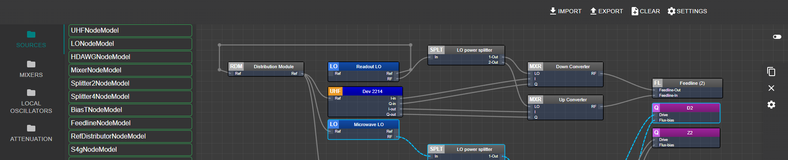
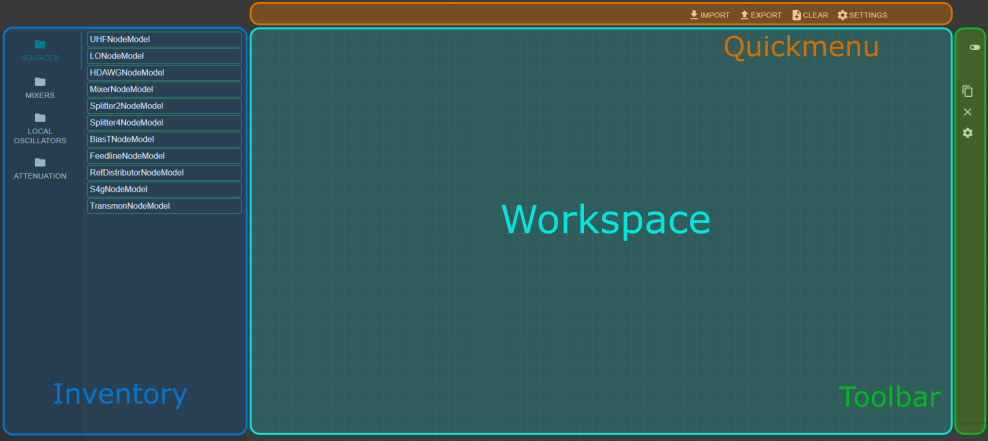

# FridgeApplication
A tool for building and maintaining hardware configurations in the context of experimental quantum computing setups.
Written in a react environment compatible with any browser-based interface.


# Disclaimer
This project is heavily inspired by [react-diagrams](https://github.com/projectstorm/react-diagrams/tree/master), a modern flow & process orientated diagramming library inspired by **Blender** and **Unreal engine**. Be sure to checkout their repository.

# Getting started
Pre:-requisities:
- Node 14.17.5 or higher
- Git
- (Adviced IDE) WebStorm or Visual studio code

To execute the application, navigate to the project root and run:
```bash
npm install  # Optional if npm is not installed yet.
npm start  # Start application (will run in localhost)
```
This creates a live image of the application.
In order to update changes to the code, simply run `rs` in the terminal.

# How to use
Here is the application layout with intended purpose:



- **Workspace** Place and organize nodes to create custom diagrams.
- **Inventory** A collection of preset components that can be used to construct diagrams.
- **Quickmenu** Includes the functionality for importing/exporting the workspace diagram to a json format.
- **Toolbar** (TBA) Shorthand functionality such as box-select, duplication and removal of nodes.

Each new component can be dragged into the workspace and given a name:


Different components can be linked together to indicate the flow of information:


# Project goals
1. Easy to use documentation tool for physical hardware implementations. 
2. Supports version control and visualization.
3. Supports export to various formats compatible with for example [PycQED](https://github.com/DiCarloLab-Delft/PycQED_py3) and [Quantify](https://github.com/quantify-os/quantify-core).
